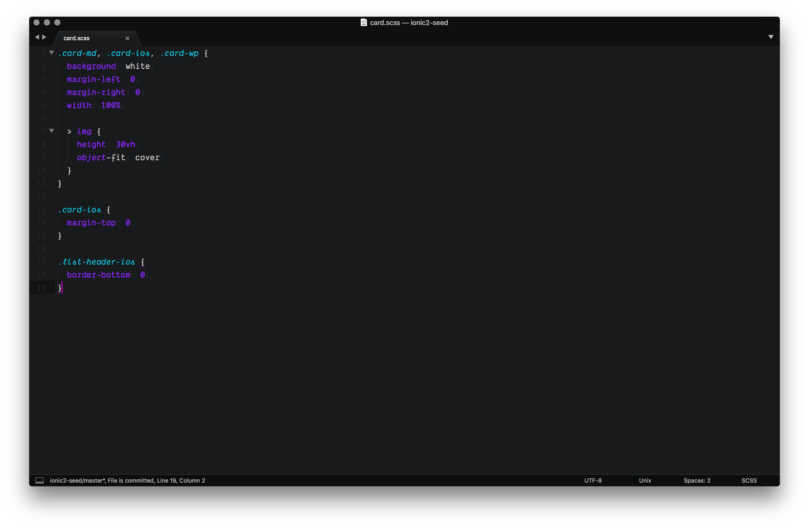

## Features

- This theme **accentuates the signal** of your code, while pushing back the noise
- Colors, italics, and subdued colors are all **meaningfully chosen** to help you understand the code
- If your code has no errors, then it **looks pythonic** (noise reduction)
- Dark mode that's been tested heavily for **day and night** use
- **Leverages cursive** if you're using [Dank Mono](https://dank.sh/) or [Operator Mono](https://www.typography.com/fonts/operator/styles/)

> Hackerman says "by far the best retro code theme"

## Screenshots

##### JavaScript

##### CSS

##### HTML

##### JSON/YAML

##### Typescript

